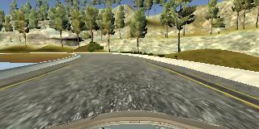
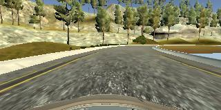

# **Behavioral Cloning**

---

**Behavioral Cloning Project**

The goals / steps of this project are the following:
* Use the simulator to collect data of good driving behavior
* Build, a convolution neural network in Keras that predicts steering angles from images
* Train and validate the model with a training and validation set
* Test that the model successfully drives around track one without leaving the road
* Summarize the results with a written report

## Rubric Points
### Here I will consider the [rubric points](https://review.udacity.com/#!/rubrics/432/view) individually and describe how I addressed each point in my implementation.  

---
### Files Submitted & Code Quality

#### 1. Submission includes all required files and can be used to run the simulator in autonomous mode

My project includes the following files:
* model.py containing the script to create and train the model
* drive.py for driving the car in autonomous mode
* model.h5 containing a trained convolution neural network
* writeup_report.md or writeup_report.pdf summarizing the results

#### 2. Submission includes functional code
Using the Udacity provided simulator and my drive.py file, the car can be driven autonomously around the track by executing
```sh
python drive.py model.h5
```

#### 3. Submission code is usable and readable

The model.py file contains the code for training and saving the convolution neural network. The file shows the pipeline I used for training and validating the model, and it contains comments to explain how the code works.

### Model Architecture and Training Strategy

#### 1. An appropriate model architecture has been employed

My model consists of a convolution neural network with 3x3 filter sizes and depths between 24 and 64 (model.py lines 90-93)

The model includes RELU layers to introduce nonlinearity (code line 97 - 102), and the data is normalized in the model using a Keras lambda layer (code line 85).

#### 2. Attempts to reduce overfitting in the model

The model contains dropout layers in order to reduce overfitting (model.py lines 96).

The model was trained and validated on different data sets to ensure that the model was not overfitting (code line 15). The model was tested by running it through the simulator and ensuring that the vehicle could stay on the track.

#### 3. Model parameter tuning

The model used an adam optimizer, so the learning rate was not tuned manually (model.py line 105).

#### 4. Appropriate training data

Training data was chosen to keep the vehicle driving on the road. I used a combination of center lane driving and recovering from the left and right sides of the road.

For details about how I created the training data, see the next section.

### Model Architecture and Training Strategy

#### 1. Solution Design Approach

The overall strategy for deriving a model architecture was to train a model that fits the data properly.

My first step was to use a convolution neural network model similar to the Nvidia model. I thought this model might be appropriate because it was developed to tackle a similar problem.

In order to gauge how well the model was working, I split my image and steering angle data into a training and validation set. I found that my first model had a low mean squared error on the training set but a high mean squared error on the validation set. This implied that the model was overfitting. To combat the overfitting, I modified the model so that it used the dropout technology.

The final step was to run the simulator to see how well the car was driving around track one. There were a few spots where the vehicle fell off the track. To improve the driving behavior in these cases, I augmented the data. For more details, see the next section.

At the end of the process, the vehicle is able to drive autonomously around the track without leaving the road.

#### 2. Final Model Architecture

The final model architecture (model.py lines 72-85) consisted of a convolution neural network with the following layers and layer sizes:

My final model consisted of the following layers:

| Layer         		|     Description	        					|
|:---------------------:|:---------------------------------------------:|
| Input         		| 90x320x3 RGB image   							|
| Convolution     	| 5x5 kernel, 1x1 stride, valid padding, outputs 86x316x24 	|
| Max pooling	      	| 2x2 stride, valid padding, outputs 43x158x24 				|
| RELU					|												|
| Convolution     	| 5x5 kernel, 1x1 stride, valid padding, outputs 39x154x36 	|
| Max pooling	      	| 2x2 stride, valid padding, outputs 19x77x36			|
| RELU					|												|
| Convolution     	| 5x5 kernel, 1x1 stride, valid padding, outputs 15x73x48 	|
| Max pooling	      	| 2x2 stride, valid padding, outputs 7x36x48 				|
| RELU					|												|
| Convolution     	| 3x3 kernel, 1x1 stride, valid padding, outputs 5x34x64 	|
| Max pooling	      	| 2x2 stride, valid padding, outputs 2x17x64 				|
| RELU					|												|
| Flatten |output 2176|
| Fully connected		| input 2176, output 1024      									|
| RELU |apply dropout after activation, keep_prob = 0.5  |
| Fully connected		| input 1024, output 128			|
| RELU | |
| Fully connected		| input 128, output 10			|
| RELU | |
| Fully connected		| input 10, output 1			|


#### 3. Creation of the Training Set & Training Process

I recorded two laps on track one using center lane driving. However, the data I collected was not quite useful because I controlled the steer using keyboard
and the numeric values of the angels were not smoothing.

In the end, I downloaded the datasets from the classroom. To get enough data points,
I used multiple cameras. Here are example images taken from left/center/right cameras.


To augment the data sat, I also flipped images and angles when the angles are not trivial, which would mitigate the left or right bias.

For example, here is an image that has then been flipped:




After the collection process, I had 33472 number of data points. I then preprocessed this data by 1) normalized the images 2) remove the top and bottom pixels that may don't contain useful information.

I finally randomly shuffled the data set and put 20% of the data into a validation set. The model was trained on 26777 samples and validated on 6695 samples.

I used a generator to build mini-batchs on the fly. I used training data for training the model. The validation set helped determine if the model was over or under fitting. The ideal number of epochs was 3 as evidenced by the visualization of loss. I used an adam optimizer so that manually training the learning rate wasn't necessary.
